# pynq-z2重构

## 实现功能

PS端实现片上Linux系统。

PL端实现LED控制，分为静态区与动态区逻辑。

静态区控制LED0-LED1实现正向流水灯，从LED0开始交替点亮，每隔1.6s变换一次。

动态区控制LED2-LED3实现不同的闪烁逻辑：

pr1：实现正向流水灯，从LED2开始交替点亮，每隔1.6s变换一次;

pr2：实现反向流水灯，从LED2开始交替点亮，每隔1.6s变换一次;

pr3：同时点亮LED2和LED3；

pr4：同时熄灭LED2和LED3。

系统时钟sysclk（125MHz）作为输入时钟，BTN0作为LED控制逻辑的复位。

////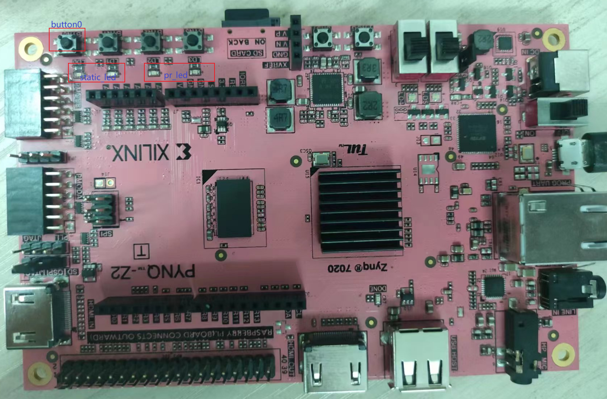


管脚约束：

LED0:R14；LED1:P14；LED2:N16；LED3:M14；SYS_CLK:H16；BTN0:D19

## 设计环境

- Vivado2018.3
- Petalinux2018.3

## PS端设计

要实现嵌入式Linux系统，首先需要在工程中添加ZYNQ7 Processing System器件。


- 根据需求开启需要的接口。
- 完成后验证保存Block Design设计。依次点击Generate Output Products和Create HDL Wrapper，生成对应的模块代码。

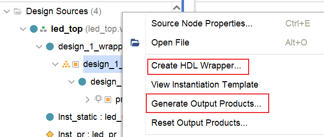

- 修改顶层模块，增加bd模块的例化。

注：不添加Block Design设计，无法导出硬件生成hdf文件。问题现象如下：

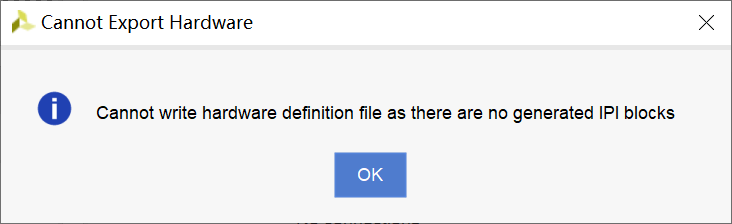

## 项目模式PL端设计

1、新建工程，点击Tools->Enable Partial Reconfiguration，使能后如下所示，增加了Partial Reconfiguration Wizard选项

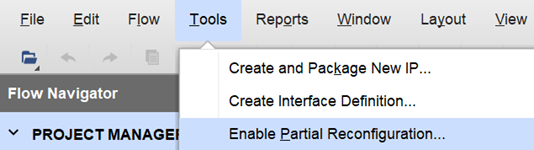

2、导入代码文件，右键点击选择做重构的模块，选择Create Partition Definition。

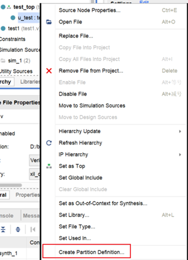

3、点击Partial Reconfiguration Wizard选项，添加多个重构的代码文件，根据提示进行以下操作。

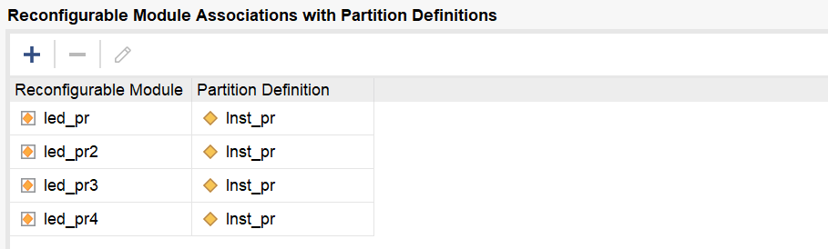

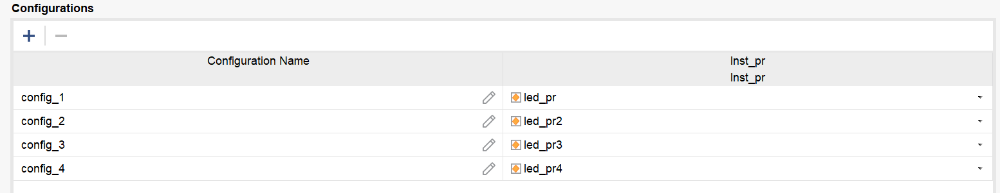

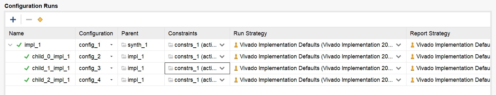

4、进行综合，完成综合后打开综合设计，通过以下操作，进行动态区划分：

- 画出一块作为Pblock

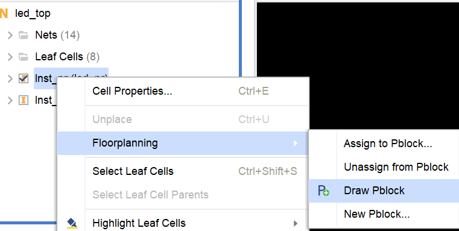

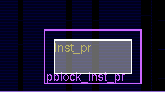

- 选中Pblock之后，更改Pblock的属性，勾选中RESET_AFTER_RECONFIG，将SNAPPING_MODE改为Routing（或者设为On）

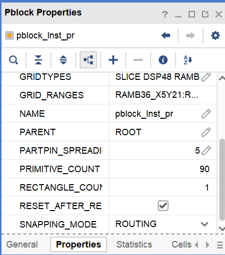

- 点击左侧Open Syntheszed Design ->Report DRC，验证Pblock创建是否有效。如果提示No Violations Found，则说明上面的操作过程没有问题。

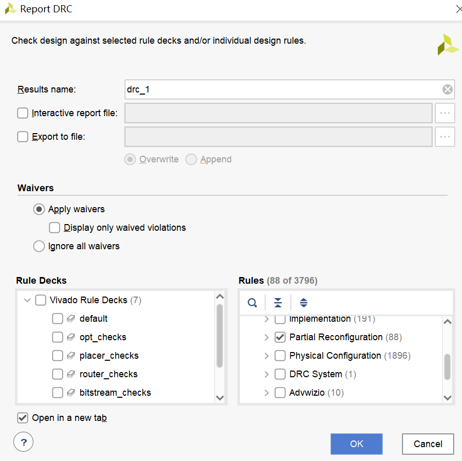

- 保存Pblock设计，添加到约束文件中。

5、重新综合、布局布线、生成比特流

根据设计Configuration规划不同分别会在impl_1、child_0_impl1…文件夹中生成对应的全局bit和动态区bit。

## 非项目模式PL端设计

使用Vivado2018.3 Tcl Shell完成。

需要文件：

顶层模块：led_top.v（包含动态区黑盒模块）

静态模块：led_static.v

动态模块：led_pr1.v/led_pr2.v/led_pr3.v/led_pr4.v

约束：top.xdc（管脚约束）、top_impl.xdc（pblock约束）

可以将tcl命令集合到tcl脚本文件中，通过下面命令运行：

```
source ./**.tcl
```

run_config1.tcl实现静态设计和包含rp1的configuration1设计：

```
#读取文件，top.xdc只包含管脚约束
read_verilog led_top.v
read_verilog led_static.v
read_verilog led_pr1.v
read_xdc top.xdc

#综合顶层模块,导出综合网表
synth_design -flatten_hierarchy rebuilt -top led_top -part xc7z020clg400-1
write_checkpoint top_synth.dcp

#综合RM模块，导出综合网表
synth_design -mode out_of_context -flatten_hierarchy rebuilt -top led_pr1 -part xc7z020clg400-1
write_checkpoint rp1_a_synth.dcp

#组合顶层网表、RM网表和约束文件,定义重构区，top_impl.xdc中包含了重构区创建pblock的约束
open_checkpoint top_synth.dcp
read_xdc top_impl.xdc
set_property HD.RECONFIGURABLE true [get_cells Inst_pr]
read_checkpoint -cell Inst_pr rp1_a_synth.dcp

#生成Configuration1布局布线后完整设计(静态+动态逻辑)的dcp(Top routed dcp）
opt_design
place_design
route_design
write_checkpoint config1_routed.dcp

#生成动态逻辑的布局布线后dcp(RM routed dcp)
write_checkpoint -cell Inst_pr rp1_a_route_design.dcp

#去掉动态逻辑(为了加入新的动态逻辑网表做准备)
update_design -cell Inst_pr -black_box

#锁定所有静态部分的布局布线信息, 保证静态部分在之后所有的Configuration中都不再有任何变化
lock_design -level routing

#生成只包含静态逻辑的dcp(此时动态模块为黑盒)
write_checkpoint static_routed.dcp

#生成configuration1设计对应的bit文件与Partial bit文件  
open_checkpoint config1_routed.dcp
write_bitstream -bin_file config1
```

run_config_others.tcl实现其他configuration设计(新增RM模块的方法同理)（需要用到前个tcl脚本生成的静态dcp）：

```
#Configuration2
read_verilog led_pr2.v
synth_design -mode out_of_context -flatten_hierarchy rebuilt -top led_pr2 -part xc7z020clg400-1
write_checkpoint rp1_b_synth.dcp
open_checkpoint static_routed.dcp
read_checkpoint -cell Inst_pr rp1_b_synth.dcp
opt_design
place_design
route_design
write_checkpoint config2_routed.dcp
write_checkpoint -cell Inst_pr rp1_b_route_design.dcp
open_checkpoint config2_routed.dcp
write_bitstream -bin_file config2

#Configuration3
read_verilog led_pr3.v
synth_design -mode out_of_context -flatten_hierarchy rebuilt -top led_pr3 -part xc7z020clg400-1
write_checkpoint rp1_c_synth.dcp
open_checkpoint static_routed.dcp
read_checkpoint -cell Inst_pr rp1_c_synth.dcp
opt_design
place_design
route_design
write_checkpoint config3_routed.dcp
write_checkpoint -cell Inst_pr rp1_c_route_design.dcp
open_checkpoint config3_routed.dcp
write_bitstream -bin_file config3

#Configuration4
read_verilog led_pr4.v
synth_design -mode out_of_context -flatten_hierarchy rebuilt -top led_pr4 -part xc7z020clg400-1
write_checkpoint rp1_d_synth.dcp
open_checkpoint static_routed.dcp
read_checkpoint -cell Inst_pr rp1_d_synth.dcp
opt_design
place_design
route_design
write_checkpoint config4_routed.dcp
write_checkpoint -cell Inst_pr rp1_d_route_design.dcp
open_checkpoint config4_routed.dcp
write_bitstream -bin_file config4
```

以上项目模式和非项目模式PL设计生成的bit配置文件都可以通过JTAG烧写上板验证。（Open Hardware Manager -> Open Target -> program device）。

但要通过PS端控制PL端实现重构，就要使用Petalinux制作嵌入式Linux系统。

## 嵌入式Linux系统设计

预先准备：

1、petalinux2018.3安装完成

2、petalinux本地化配置文件下载完成（aarch64、downloads）

3、Vivado生成hdf文件（File->Export->Export Hardware，勾选Include bitstream）

设计步骤如下：

```
(1) 新建⼯程文件夹，例如test
(2) 在⼯程文件夹下打开终端
(3) source /opt/pkg/petalinux/2018./settings.sh
(4) petalinux-create -t project --name led_pr --template zynq
(5) cd test/
(6) 将Vivado生成的hdf文件，放在test/hdf/文件夹下
(7) petalinux-config --get-hw-description=./hdf
(8) 跳出配置框，进⾏配置：
①选择Yocto Settings
②选择Add pre-mirror url，修改为file:///home/Xilinx/sstate-rel-v2018.3/downloads
③选择Local sstate feeds settings，修改为/home/Xilinx/sstate-rel-v2018.3/aarch64
④移动到Enable Network sstate feeds，按N使其不使能
(9) petalinux-build
(10) cd ./images/linux
(11) petalinux-package --boot --fsbl zynq_fsbl.elf --fpga system.bit --u-boot u-boot.elf
得到了需要的BOOT.bin和image.ub文件，复制到SD卡中，插入开发板中，以SD卡模式启动开发板即可
```

## 片上重构实现

ZYNQ系列板卡在完成嵌入式系统设计后，PL端受控于PS端，可以通过Linux  FPGA Manager 来实现PL端配置文件的重加载。

但Linux  FPGA Manager 在ZYNQ系列板卡上**只支持整体bit流的加载，不支持部分bit流的重构**。

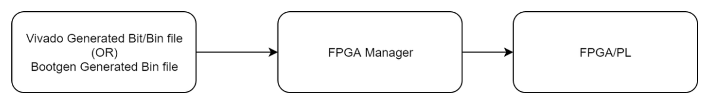

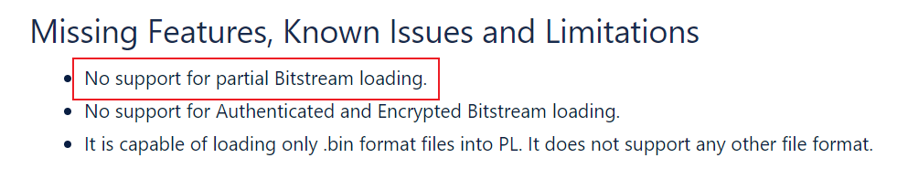

经过尝试，**通过AXI_HWICAP IP核也无法实现动态重构**。

所以此处只展示通过Linux  FPGA Manager 实现整体bit流的重加载。

挂载SD卡命令（将SD卡挂载到mnt文件夹下，访问mnt文件夹即可访问SD卡内容）：

```
mount /dev/mmcblk0p1 /mnt
cd /mnt
```

整体重加载脚本reconfig.sh：

```
#! /bin/bash
echo 0 > /sys/class/fpga_manager/fpga0/flags
mkdir -p /lib/firmware
cp $* /lib/firmware/
echo $* > /sys/class/fpga_manager/fpga0/firmware
```

执行sh脚本命令：

```
./reconfig.sh *.bit.bin
```

*.bit.bin为重加载的专用bin文件，需通过以下方式由bit文件转化：

（1）构建Full_Bitstream.bif文件，其内容如下（路径可更改）

```
all:
{
        D:\pynq-z2\bit2bit.bin\design_1_wrapper.bit /* Bitstream file name */
}
```

（2）在vivado 的Tsl Consol 下输入下列命令：

```
bootgen -image Full_Bitstream.bif -arch zynq -process_bitstream bin
```
